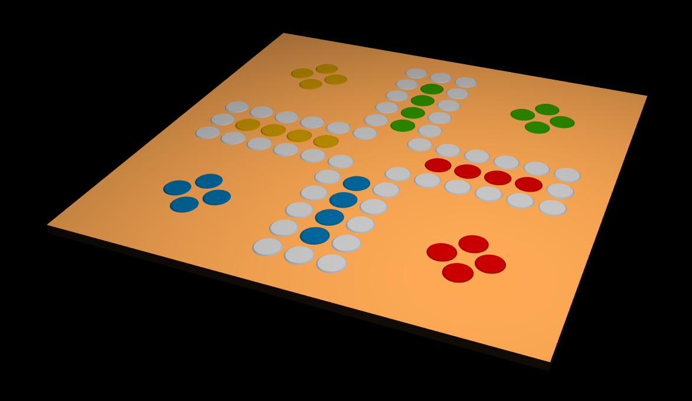

# Don't Be Mad, Bro! (Човече, не љути се!)

- Originally a German board game [Mensch ärgere Dich nicht](https://en.wikipedia.org/wiki/Mensch_%C3%A4rgere_Dich_nicht) from 1907.
- The point of the project is to experiment with 3D. I mostly have no idea what I'm doing.

Here's a recent screenshot from the project:

